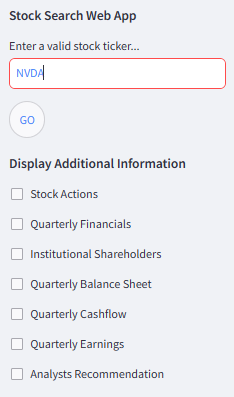
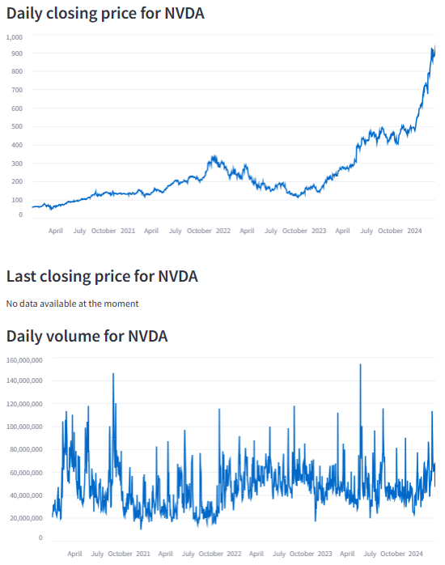
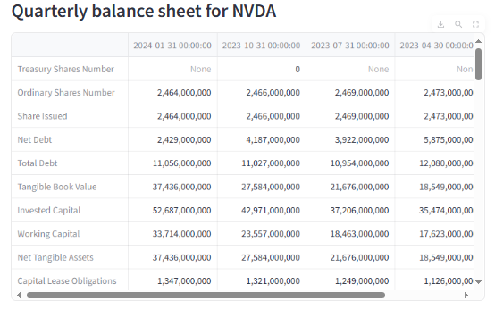
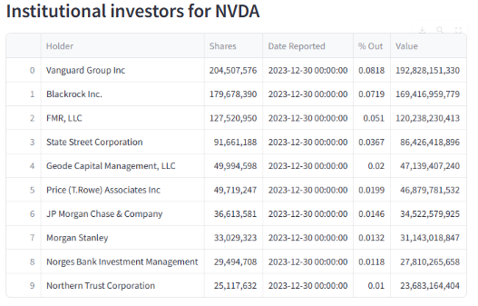

# 📈 StockApp - Real-Time Stock Analysis & Insights

## 📌 Course Information
**Course Name:** AF3005 – Programming for Finance  
**Instructor:** Dr. Usama Arshad  

---

## 🚀 App Overview
StockApp is an **interactive financial analysis and stock tracking application** built using **Streamlit** and `yfinance`. The app provides:
✅ **Live stock prices & historical data retrieval** 📊  
✅ **Balance sheets, income statements & cash flow analysis** 💰  
✅ **Stock trends visualization with dynamic charts** 📈  
✅ **Dividend & stock split monitoring** 💵  
✅ **User-friendly UI with animated transitions** 🎨  

---

## 🛠 Installation Guide  
### Run Locally in 4 Easy Steps:

1️⃣ **Clone the repository:**  
   ```sh
   git clone https://github.com/Fawad-Liaqat/stockapp.git
   cd stockapp/app
   ```
2️⃣ **(Optional) Create a virtual environment:**  
   ```sh
   python -m venv venv
   source venv/bin/activate  # On Windows use: venv\Scripts\activate
   ```
3️⃣ **Install dependencies:**  
   ```sh
   pip install -r requirements.txt
   ```
4️⃣ **Run the app:**  
   ```sh
   streamlit run app.py
   ```

🔹 The app will open in your browser automatically! 🎉  

---

## 🌍 Deployment Link  
👉 **[Try StockApp Live](https://share.streamlit.io/Fawad-Liaqat/stockapp/main/app.py)**  

---

## 📷 Screenshots & Demo 🎥
### **📌 Home Page**  
📍 *Navigate effortlessly through stock insights*  


### **📈 Stock Price Analysis**  
📍 *Track real-time and historical stock prices*  


### **📊 Balance Sheet Overview**  
📍 *Dive into financial statements with ease*  


### **📜 Investor Data Insights**  
📍 *Make informed investment decisions*  



## 📌 GitHub Repository  
🔗 **[Visit GitHub Repo](https://github.com/Fawad-Liaqat/stockapp)**  

🚀 **Contributions & Feedback Welcome!** 💡  
📧 Reach out for queries or improvements!  

